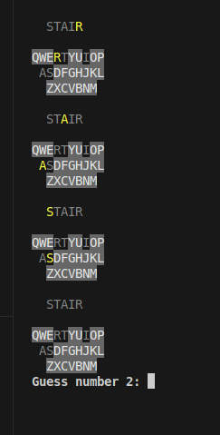

# C++ Console Multi-Wordle

A terminal-based game where a single player tackles multiple, simultaneous Wordle boards at once. Test your vocabulary and deductive reasoning skills by managing several word puzzles in a single command-line interface session!

## 🚀 Features

*   **Simultaneous Boards:** Play multiple, independent Wordle games displayed stacked in your console.
*   **Classic Wordle Mechanics:** Use color-coded feedback (e.g., green, yellow, grey text) to guess letters.
*   **Configurable Difficulty:** The number of simultaneous boards can be changed.
*   **Pure C++ Console App:** Lightweight and self-contained, requiring no external dependencies or internet connection.

## ⬇️ Installation and Setup

To play the game, you need to download and run the pre-compiled executable for your operating system.

### Prerequisites

*You need to have a compatable operating system in this case Linux

### How to Run the Game

1.  **Download:** Get the latest executable from the [Releases page](https://github.com/Aaron-c/lilyPython) or download it directly from the [itch.io page](https://lilyec.itch.io/multi-wordle).
2.  **Navigate:** Open your terminal or command prompt and go to the directory where you downloaded the executable.
3.  **Execute:** Run the game using the appropriate command for your system:
    *   **Linux:**
        ```bash
        ./multi_wordle_linux
        # If necessary, first make it executable with: chmod +x multi_wordle_linux
        ```

    ```bash
    .\multi_wordle_win.exe words.txt
    ```

## 🎮 How to Play
The point of the game is to guess all the words while using the same guess word for all boards. *More specific instructions available in the game*

*   **Playing** Enter any valid 5 letter words that will then individually apply to all active games
*   **Output** Will output coloured letters
        **Green** Letter is in the right place
        **Yellow** Letter is in the word, but in a different place
        **Gray** Letter is not in the word
*   **Ending** The game ends when the user has successfully guessed all of the words or has run out of guesses
example start with 4 wordles


## 🛠️ Building from Source (For Developers)

If you wish to compile the game yourself, you will need a C++ compiler (like g++ or Clang) and Make.

1.  **Clone the Repository:**

2.  **Build and launch the Game:**
    ```bash
    source launch
    ```
